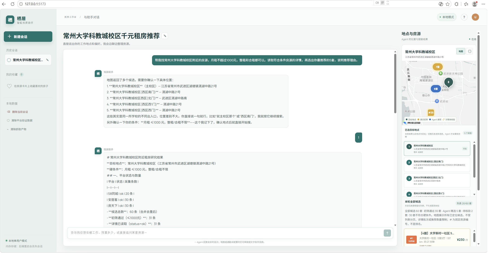
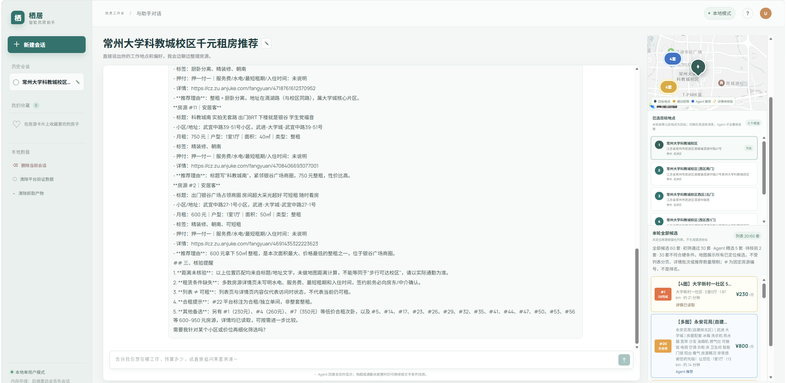
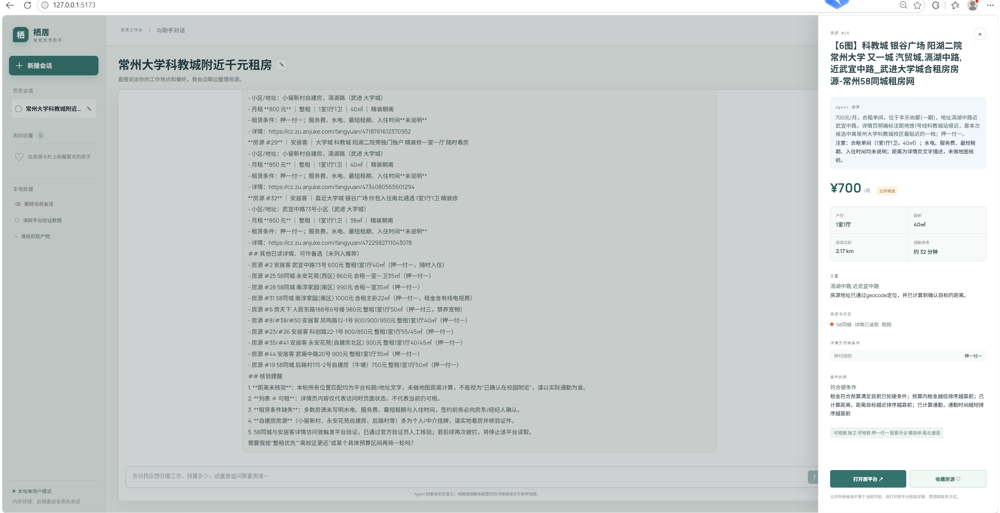
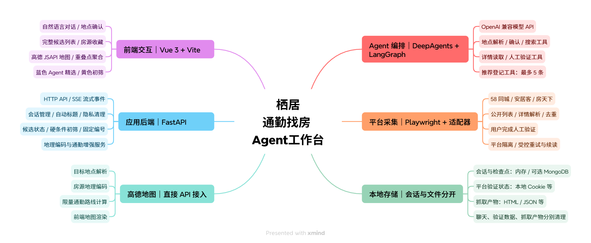

# 栖居：通勤找房 Agent

栖居是一个面向本地单用户的通勤找房工具。用户用自然语言说出目标地点、预算、户型和通勤偏好，Agent 负责确认地点、汇总多个平台的公开房源、读取可访问的详情、计算位置/通勤信息，并把“完整候选池”和“Agent 精选推荐”分开展示。

> 本项目目前是个人学习与非商业研究项目。房源信息来自公开页面，可能过期；请以原平台、房东/中介和实地看房结果为准。

## 项目展示

### 主界面与地点确认

以“常州大学科教城校区附近、月租不超过 1000 元、整租和合租不限”为例，展示自然语言需求、目标地点确认和地图候选。



### 推荐结果与房源展示

聊天展示 Agent 的推荐理由，房源卡片与地图区分蓝色精选、黄色初筛候选，并保留核验状态。



### 房源卡片详情与原平台入口

1. 点击右侧房源卡片，打开站内详情抽屉，集中查看推荐理由、租金、户型、面积、地址、详情读取状态，以及已获取的租赁条件和位置／通勤信息。
2. 点击抽屉底部的“打开原平台”，在新标签页访问该房源的来源链接，进一步核实详情、费用和联系方式。若候选只有平台列表链接，按钮会显示“打开平台列表”。



这张截图展示的是站内详情与跳转入口，不是外部平台页面。原平台可能要求人工验证；未读取或未计算的信息不代表已核验。

> 图片来自实际运行，仅展示当次结果；房源价格、平台访问情况和可租状态可能变化。

## 核心能力

- 自然语言对话：直接描述学校、公司、地标、预算、户型和通勤要求，不要求输入固定的 A/B 选项。
- 地点确认：通过高德 Web Service 解析地点；存在歧义时提供候选，用户可以回复名称、序号或自然语言描述来确认。
- 多平台搜索：统一整理 58 同城、安居客和房天下的公开列表结果，保留来源平台、原始链接和平台状态。
- 详情核验：对有真实详情链接的候选读取详情页；遇到访问控制时区分验证、重定向、失败和未访问，不把“没有读到”说成“没有房源”。
- 房源详情与来源跳转：点击卡片查看详情抽屉，可收藏房源，并通过“打开原平台”继续核实来源信息。
- 分层展示：地图和右侧列表保留完整候选池；聊天只展示 Agent 真正登记的最多 5 条精选推荐。
- 地图展示：将目标地点、可定位房源、通勤信息和重叠点聚合展示；黄色表示初筛通过，蓝色表示 Agent 精选。
- 会话恢复：支持会话历史、暂停/恢复和可选的 MongoDB checkpoint 持久化。
- 隐私清理：支持删除聊天与执行状态、单独清除平台验证状态，以及清理本地抓取产物。
- 快速模式：默认使用内存存储，不需要 MongoDB；适合第一次体验和本地演示。
- Windows 一键部署：提供 `install`、`setup`、`start` 的 `.bat` 和 PowerShell 入口。

## 系统模块架构

项目由前端交互、应用后端、Agent 编排、平台采集、高德地图和本地存储六部分组成。



图中的连线表示模块组成，不代表调用顺序，也不代表需要单独部署六个服务。高德 Web Service 用于后端地点解析、地理编码和通勤计算，JSAPI 用于前端地图展示；MongoDB 是可选的持久化存储。

一次搜索可以理解为：

1. Agent 确认目标地点和必要条件。
2. 搜索工具从各平台获得候选池。
3. 后端按预算、户型等硬条件初筛，并读取可访问的详情。
4. Agent 通过推荐工具登记真正推荐的房源。
5. 列表保留完整候选池，地图展示可定位的候选，聊天只讲精选推荐。

## 目录结构

```text
backend/                   FastAPI、Agent、平台适配器和后端测试
frontend/                  Vue 3 + Vite 前端和前端测试
scripts/                   后端/前端启动脚本
docs/images/               项目展示截图与架构图
install.bat / install.ps1  空 Windows 机器安装 Python、Node.js 和项目依赖
setup.bat / setup.ps1      已有 Python、Node.js 时安装项目依赖
start.bat / start.ps1      启动后端、前端并打开浏览器
```

## Windows 快速开始

适用于 Windows 10/11。第一次使用时，在项目根目录运行：

```powershell
.\install.bat
```

安装入口会检查 Python 3.11+ 和 Node.js 18+；系统有 `winget` 时会尝试通过官方包源安装缺失的基础环境，然后：

- 创建项目虚拟环境 `.venv`；
- 安装后端 Python 依赖；
- 安装前端 npm 依赖；
- 安装 Playwright Chromium；
- 创建 `backend/.env` 和 `frontend/.env.local`（已有配置不会覆盖）。

首次安装默认使用真实房源搜索（`RENTAL_DEMO_MODE=live`）和内存存储（`CHECKPOINT_BACKEND=memory`），无需安装 MongoDB。“本地模式”表示程序运行在本机，不表示房源数据来自离线夹具。

如果 Python 和 Node.js 已经安装，也可以运行：

```powershell
.\setup.bat
```

配置好密钥后启动：

```powershell
.\start.bat
```

浏览器打开后访问 `http://127.0.0.1:5173/`。也可以使用 PowerShell 入口：

```powershell
powershell -NoProfile -ExecutionPolicy Bypass -File .\install.ps1
powershell -NoProfile -ExecutionPolicy Bypass -File .\setup.ps1
powershell -NoProfile -ExecutionPolicy Bypass -File .\start.ps1
```

停止服务时关闭前后端窗口即可。启动脚本会检查 `8090` 和 `5173` 是否已被占用，不会自动结束用户已有进程。

## 配置密钥

安装后编辑本地私有文件：

- `backend/.env`：模型 API、高德 Web Service、房源数据源和存储方式。
- `frontend/.env.local`：高德 JSAPI Key、安全密钥和前端地图开关。

模板文件分别是 `backend/.env.example` 和 `frontend/.env.example`。真实密钥只写入私有配置，不要提交到 GitHub。

常用配置如下：

```dotenv
# backend/.env
MAIN_MODEL_API_KEY=你的模型密钥
AMAP_WEB_SERVICE_KEY=你的高德Web服务Key
RENTAL_DEMO_MODE=live
CHECKPOINT_BACKEND=memory
```

```dotenv
# frontend/.env.local
VITE_AMAP_JSAPI_KEY=你的高德Web端Key
VITE_AMAP_SECURITY_CODE=你的高德安全密钥
VITE_USE_BACKEND_CHAT=true
```

默认及未填写 `RENTAL_DEMO_MODE` 时使用 `live`，访问真实公开平台；缺少配置、网络失败或平台拦截会报告对应状态，不会自动使用示例房源替代。只有显式设置 `RENTAL_DEMO_MODE=offline` 才使用项目内的离线夹具。完全离线测试还应设置 `MAP_PROVIDER=fake`；离线房源数据不等于离线 AI，对话仍需要配置模型 API Key。

**从旧版本升级：** 安装脚本不会覆盖已有的 `backend/.env`。如果旧文件写着 `RENTAL_DEMO_MODE=offline`，请手动改为 `live`，地图使用 `MAP_PROVIDER=amap`，然后重启后端并新建会话重新搜索。旧会话中的夹具结果不会自动变成真实房源。

## MongoDB（可选）

快速模式默认使用 `CHECKPOINT_BACKEND=memory`，不需要 MongoDB。后端退出后，会话和 checkpoint 不再保留。

需要跨重启保存会话时：

1. 准备一个本机或虚拟机中的 MongoDB 服务。
2. 安装 MongoDB Python 适配依赖：

   ```powershell
   .\setup.bat -WithMongo
   ```

3. 在 `backend/.env` 中填写：

   ```dotenv
   CHECKPOINT_BACKEND=mongodb
   MONGODB_URI=mongodb://用户名:密码@虚拟机IP:27017/?authSource=admin
   MONGODB_DATABASE=rental_agent
   ```

项目不会替用户安装或启动 MongoDB，也不需要 Redis、MySQL 等其他常驻中间件。MongoDB 连接失败时会明确报错，不会静默降级到内存模式。

## 手动启动

如果不使用一键脚本，可以在项目根目录执行：

```powershell
py -m venv .venv
.\.venv\Scripts\python.exe -m pip install -r backend\requirements.txt
.\.venv\Scripts\python.exe -m uvicorn backend.app.main:app --host 127.0.0.1 --port 8090
```

另开一个终端启动前端：

```powershell
Set-Location frontend
npm install
npm run dev -- --host 127.0.0.1 --port 5173
```

## 隐私与本地数据

本项目是本地单用户工具，以下内容可能保存在本机：

- 会话显示记录、Agent 执行状态和 LangGraph checkpoint；
- 平台人工验证后保存的浏览器 Storage State；
- 采集产生的 HTML、JSON、快照和日志。

删除聊天不会自动删除平台验证状态，因为多个会话可以共用它。平台验证状态和本地抓取产物应通过各自的清理按钮或项目提供的清理入口单独处理。真实凭据、Cookie 和抓取产物都不会随 Git 提交。

## 测试与构建

后端测试：

```powershell
.\.venv\Scripts\python.exe -m pytest backend/tests
```

前端测试与生产构建：

```powershell
Set-Location frontend
npm test
npm run build
```

## 数据源与使用边界

58 同城、安居客、房天下及高德地图的数据、页面、商标和服务均归各自权利人所有。使用真实平台采集前，请确认当地法律、平台服务条款、robots 规则和访问频率要求。项目不会自动解验证码、绕过登录或轮换代理；遇到平台验证时，需要用户在可见浏览器中完成人工验证。

## 许可证

本项目采用根目录 [LICENSE](LICENSE) 中的“非商业使用许可（NC-1.0）”。允许学习、研究、个人使用、修改和非商业再分发，禁止商业使用。第三方依赖和数据源按各自条款执行。
